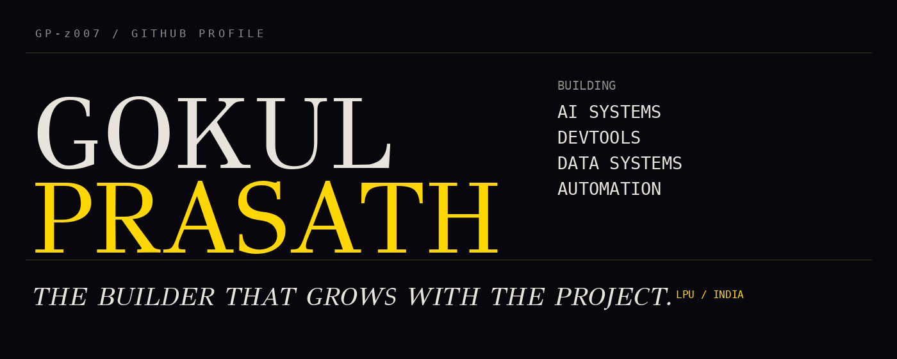
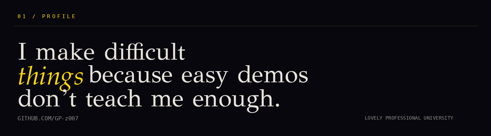
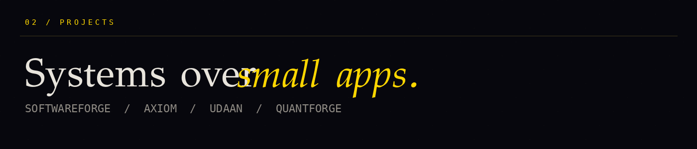
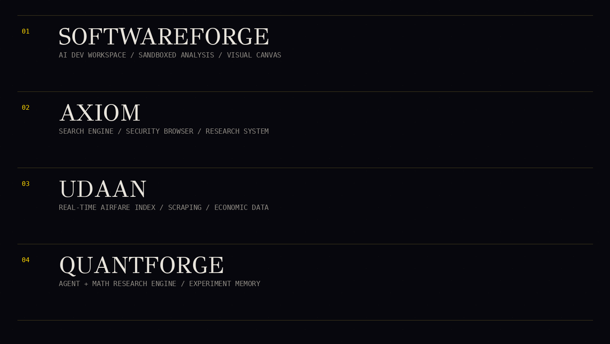
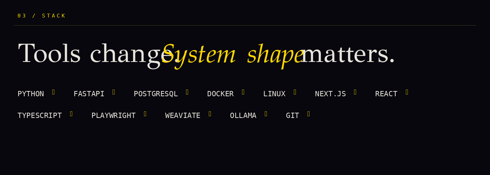
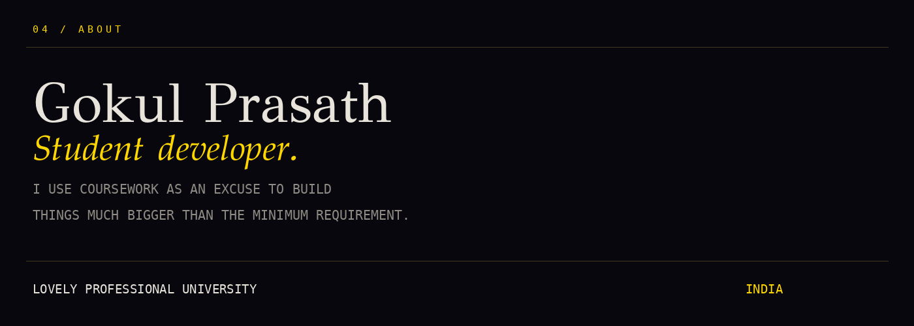
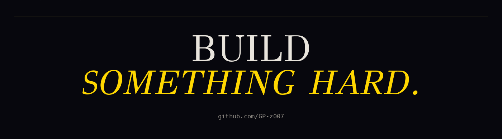

<!--
GitHub Profile README for GP-z007
Hermes Agent landing-page-inspired layout.
No React, CSS, JS, or external deployment required.
-->

  

  

  

  

  

  
  

  

  
  

  

  

  

  

  

  

