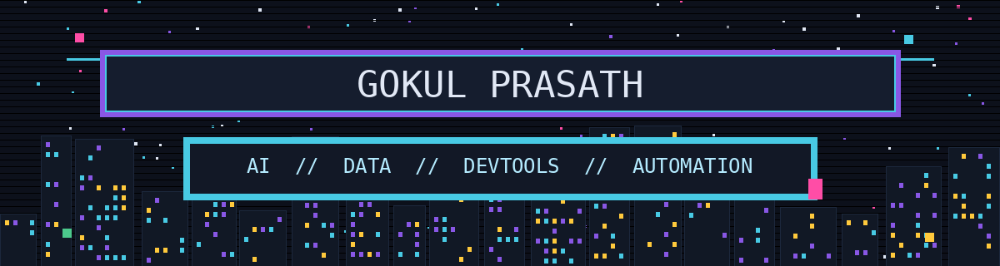
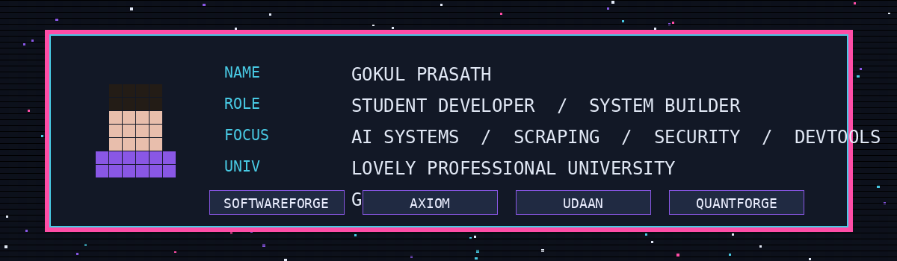
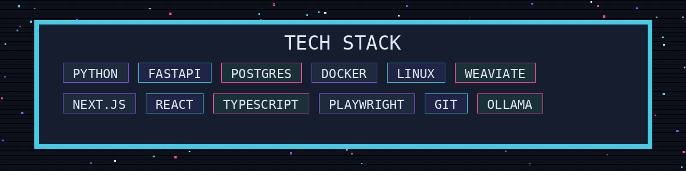
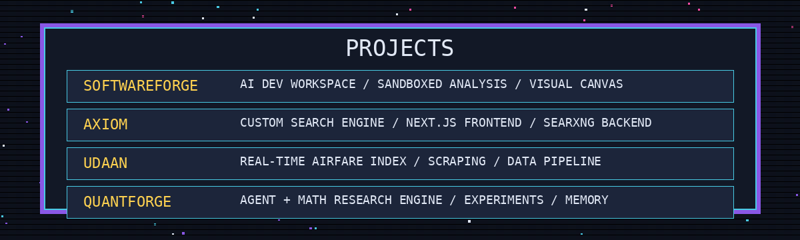
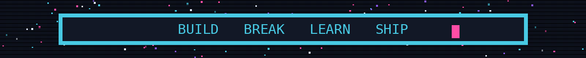

<!--
Pixel-dark GitHub profile README for GP-z007.
Visible content is image-first with animated / pixel elements.
Inspiration links:
1. https://github.com/abhisheknaiidu/awesome-github-profile-readme
2. https://github.com/LuciNyan/pixel-profile
3. https://github.com/DenverCoder1/readme-typing-svg
4. https://github.com/Platane/snk
5. https://github.com/anuraghazra/github-readme-stats
6. https://github.com/ryo-ma/github-profile-trophy
7. https://github.com/antonkomarev/github-profile-views-counter
8. https://github.com/tandpfun/skill-icons
9. https://github.com/yoshi389111/github-profile-3d-contrib
10. https://github.com/codewithwan/awan
-->

  

  

  

  

  
  

  

  

  

  

  

  

