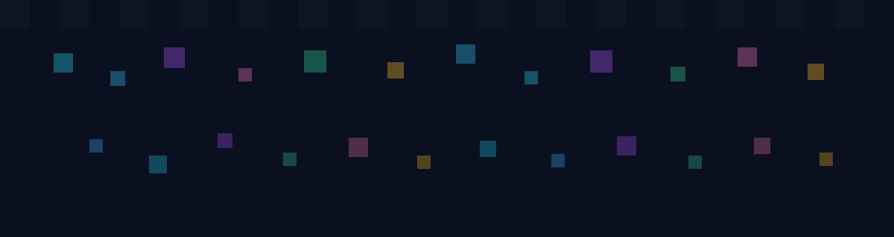

  

  

  

  
  
  

<table align="center">
  <tr>
    <td align="center" width="220">
      
       
      
    </td>
    <td width="520">
      <h2>👋 About Me</h2>
      <ul>
        <li>🔭 Currently building: <b>Axiom</b></li>
        <li>🌱 Learning continuously and improving every day</li>
        <li>💬 Ask me about: <b>troubleshooting</b> and solving technical problems</li>
        <li>⚡ Fun fact: I debug best in 8-bit mode 😄</li>
      </ul>
      

        
        
        
      

    </td>
  </tr>
</table>

---

## 🧩 Projects
<table>
  <tr>
    <td width="60">
      
    </td>
    <td>
      <b>Axiom</b> — Current primary project focused on hands-on building and practical problem-solving.
    </td>
  </tr>
  <tr>
    <td width="60">
      
    </td>
    <td>
      More projects coming soon as I keep building and learning.
    </td>
  </tr>
</table>

---

## 🛠️ Tech Nerd Stack

  
  
  
  
  
  

---

## 📊 Live Stats

  
  

  

---

  

